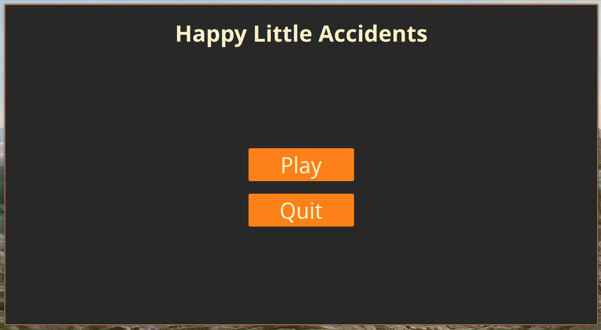
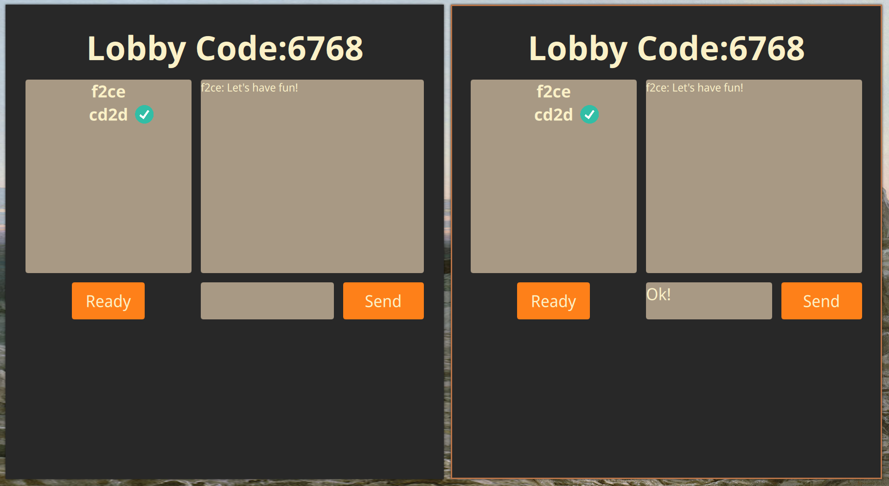
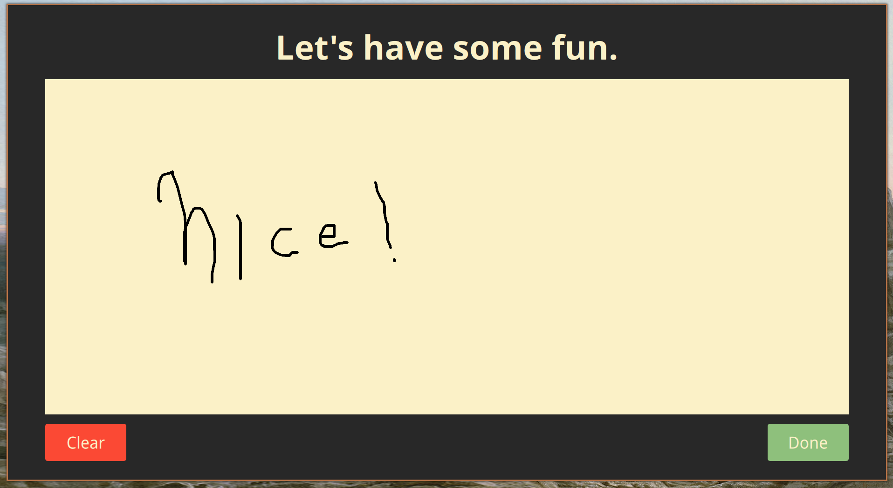

# Happy Little Accidents

## Objective

To build a desktop multiplayer drawing game with the following features:

- Each player is able to create it's own room and share it with others in order to play together

- Each room has a real time text chat 

- Everyone must be ready to play before the game begins

- Players must be able to draw with any given cursor input (ie: mouse, tablet, etc)

## The Stack

- Qt6 core and Qt6 Websockets 

- QML

- CMake

## Structure

The application is splitted in two parts: Client and Server.

Whenever the program is running, only a single instance of the server is needed, however, there can be created as many client instances as necessary.

Using both **Websockets** and the **signal/slot** architecture from Qt a message protocol was implemented betweenn the Server and Client, making it possible for the client to make requests such as getting an user ready or saving a drawing.

## In Action

